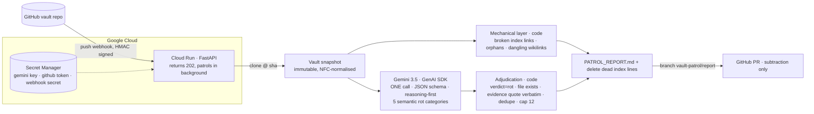

# Architecture

Exported image: [architecture.png](architecture.png) (regenerate with `npx -y @mermaid-js/mermaid-cli -i <mermaid block> -o docs/architecture.png -b white -w 2000`).

## Why it is shaped like this

| Decision | Reason |
|---|---|
| Event-driven (push), not cron | Patrol value is proportional to accumulated change, not to the calendar. Cloud Run scales to zero between pushes. |
| Regex first, model second | Anything a regex can find never reaches the model. The model only sees semantic questions: "is this instruction stale?", "do these two notes contradict?" |
| One model call per patrol | Compound failure: 3×95% = 86%. Loops, retries (2) and termination live in `runner.py`. |
| `reasoning` is the first schema field | The model commits to a verdict only after writing why. |
| Code verifies every quote | A finding whose `evidence_quote` is not a verbatim substring of the file is dropped and counted in `dropped`. The PR never carries a hallucinated citation. |
| Subtraction-only action enum | `delete_line / mark_historical / merge_into / add_arbitration_line / needs_human`. The agent cannot invent tasks or notes. |
| No run database | Re-running updates the existing PR instead of opening a second one, so idempotency needs no state. `model_version` + `prompt_version` are stamped into every report for drift forensics. |
| Same entry point locally | `python -m patrol run <dir>` is the identical code path without GitHub or GCP, so the tool survives after the hackathon. |
